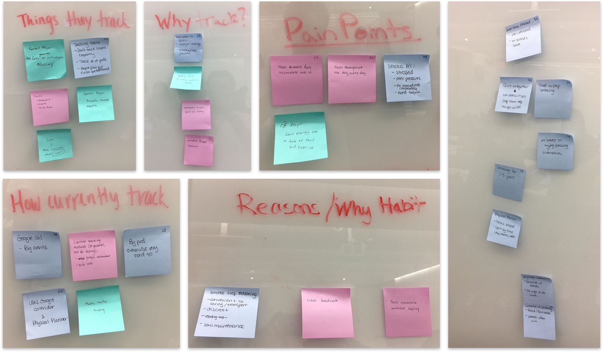
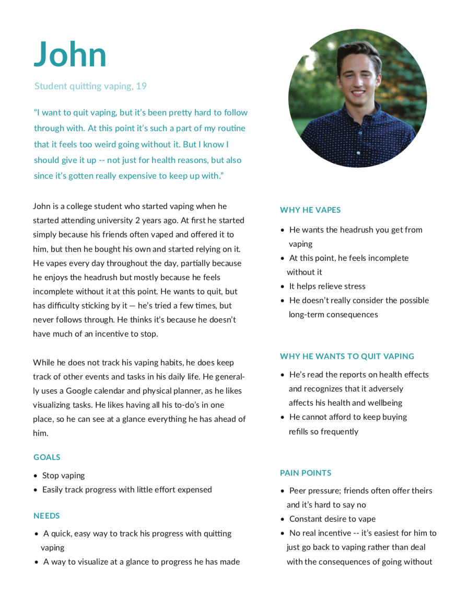
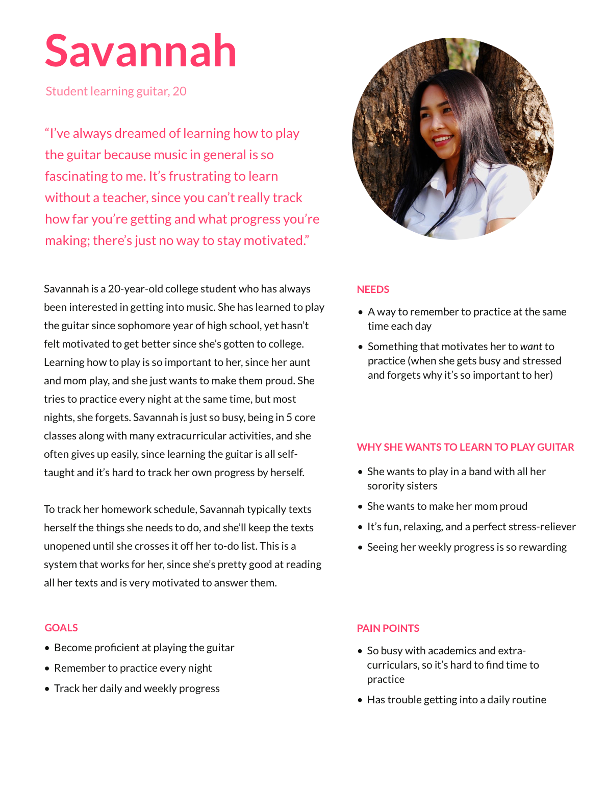
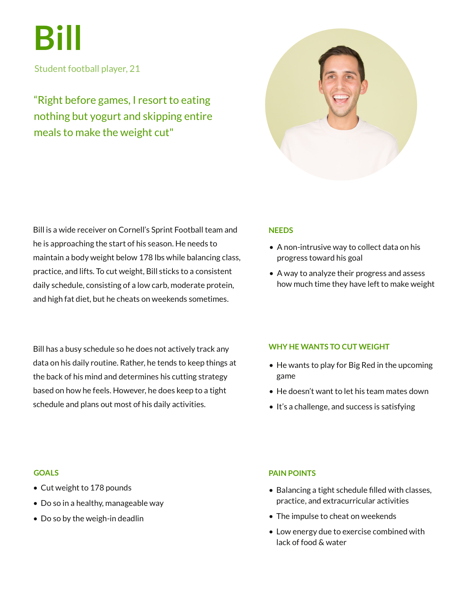

# Affinity Diagram

# Personas
## Persona 1: The person who wants to stop smoking cigarettes

## Persona 2: The person who wants to learn how to play the guitar

## Persona 3: A sprint football player who needs to lose weight

# Methods Used
We chose to interview the participants so that we could get rich, detailed information. It was important that we understand the user's values and experiences. Given our previous experience this option was something we felt we were able to execute well.

## Interview scripts and interviews can be seen in the following Markdown files:
- [Interview with Target Audience #1](interview-target-1.md)
- [Interview with Target Audience #2](interview-target-2.md)
- [Interview with Target Audience #3](interview-target-3.md)

# Value Propositions

## **Alternatives:**
**Notebook / Pen & Paper**
  * Costs:
    - Our app is more successful and more lightweight because you don’t have to carry around a notebook, can sync wirelessly with computer, phone, etc. View entries in multiple formats (example: visuals). Cheaper than notebook? Fast to type than write.
  * Benefits: 
    - 100% “customizable” -- up to you how you want to structure tracking

**Major competitor: Nomie**
  * Costs:
    - The sophisticated features of Nomie cost money, while our app is free.
    - Nomie is not as customizable, it takes a one size fits all approach. 
    - UI is overcomplicated, can deter user
  * Benefits:
    - Has advanced features like Face ID

**Nothing (No Tracking):**
  * Costs:
    - Our app makes it easy to track everything that would be otherwise difficult to remember in your head
    - Our app gives a quick, easy visualization of progress that would not be available to those who track nothing
    - Our app incentivizes users to complete their tasks and continue documenting, whereas with no tracking, you would have much less incentive to complete your goal
  * Benefits:
    - Doing nothing takes less effort, but will probably reap fewer results

**Google Calendars:**
  * Costs:
    - Our app provides the ability to add context through notes and specific measurements as opposed to a single event like in Google Calendar
    - Our app incentivizes user to accomplish and continue documents their tasks while Google Calendar has no such feature

*While it does take some of the user’s time to input their entry, we designed the process to require as little information as possible as per the identified user need of minimal effort. Of course, this does take more time than not tracking at all, however we think that the benefits of our visualization, documentation, and incentivization far outweigh the cost of entry time. Overall, we see the value of our app compared to alternatives to be the categorization of projects, customization of specific field measurements, visualization of the frequency of entries, and incentivization through the emoji system to encourage users to continue documenting and accomplishing their goals.*

# New Scenarios

Note to Instructors: Upon review of our Milestone 2 Feedback, we have revised our scenarios. These changes ended up factoring into how we conducted our user testing, so we have included an updated list. 

### **Scenario for Persona 1:**

Goal: Log an individual data point.
Successfully Passes Testing If: The test-user can add an individual entry to an existing project

Scenario: Serena works as a software engineer at a large company. Serena has been smoking for 25 years and smokes almost every day. Despite her best attempts, Serena is constantly unaware of how much she smokes until she finishes her pack. To manage her work stress, Serena often steps out after her lunch for a smoke-break. However, she really wants to stop smoking. In order to help her, Serena has begun using a new phone tracking application, which has allowed her to become more aware of her smoking schedule. Serena uses this application throughout the day to log individual smoking instances in order to later remind herself how often she is smoking. 

### **Scenario for Persona 2:**

Goal: Set up a new project to track.
Successfully Passes Testing If: The test-user can create a new project to track data within.

Scenario:  Jack, 16 years young, has been playing guitar for a couple months now. He got into guitar playing because he grew up with his dad playing the instrument, and he wants to improve. As much as he enjoys music and guitar, he feels like he hasn’t really been consistent with his playing. It is hard for him to commit to something when he doesn’t stick to a schedule, and thus Jack is compelled to track his guitar playing progress. The best part is that his new phone tracking application allows him to quickly create a project which he can later add entries to.

### **Scenario for Persona 3:**

Goal: Record multiple types of data within one project.
Successfully Passes Testing If: The test-user can add multiple types of data to the same project.

Scenario: Bill is a 20-year old Spring Football player at Cornell University. He often has to cut weight for his pre-game weigh-ins. However, Bill often cheats on weekends, binge eating food and drinking lots of water. He often grows frustrated with destroying his weekly progress and he uses his new phone tracking application to help him stay on track. The best part of his new application is that he can track multiple data-sets in the same project, from how much water he is drinking to the calories he has burned. 

# Project Themes (**Minimum Viable Product**)

### **Visualization:**
  * Keep track of progress towards goals 
  * Mark as complete / goal achieved

### **Documentation/Recording:**
  * Remember user input of previous recordings
  * Offer users way to add note/entry/task to project (ex. Photos, text, time, location, etc.) 
  * Add a project (overarching goal / category)

### **Incentivization:**
  * Use of emojis to encourage daily tracking (ex. positive emojis for encouraging user to maintain a streak of positive behavior)  

### **Customization:**
  * Attach supplementary data to entries (text, date)
  * Calendar for tracking days and time spent
  * Categorize data into various projects/goals
  * Works across smartphones, tablets, and laptops