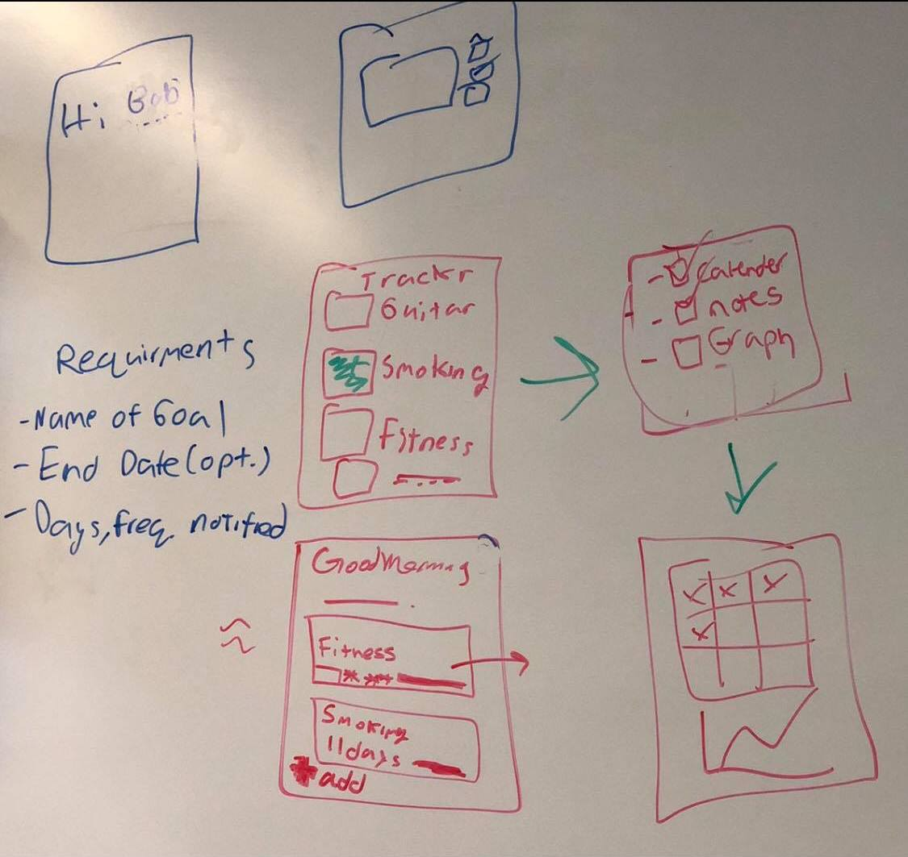
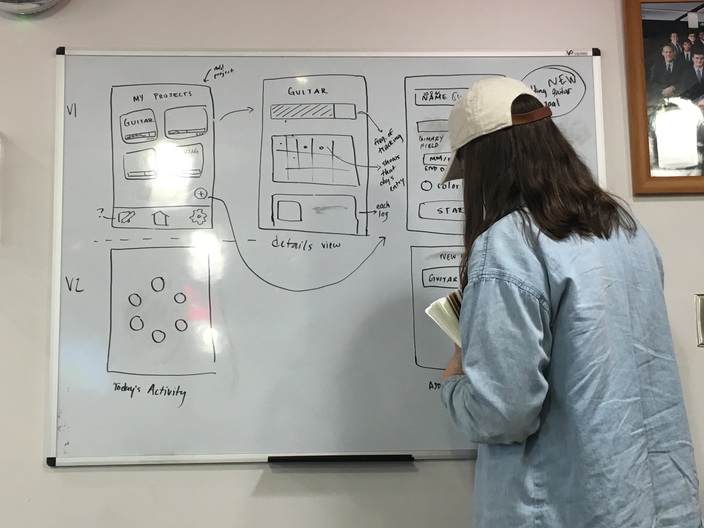
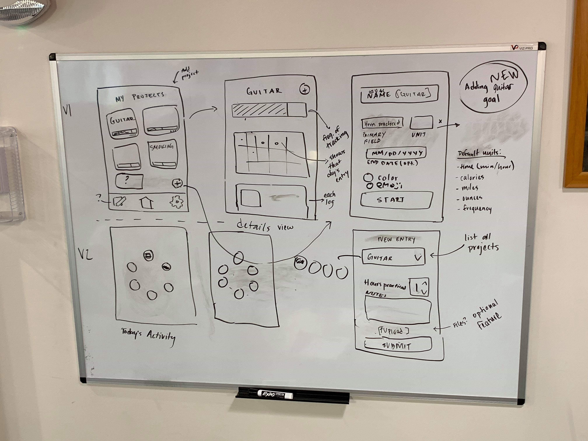

# Brainstorm

Ideas:
- Onboarding process?
- Instead of choosing project then adding entry from details page, be able to add entry from homepage
- What have you done today?
    - Today I… didn’t smoke, practiced guitar twice, worked out for 30 minutes. Moved to a category
- Data Visualization:
    - Graph?
    - Progress Bar?
    - % Improvement over last day/week/month?
    - Color intensity/opacity?
    - Emoji?

Pages:
- Home page (w/ existing projects added)
  - Empty state: add new project
      - Survey: Collect potential goals, first name,
      - should they choose what visualization types they want? (calendar, graph...?)
  - Displays all projects, can add new projects
  - Some meta data

- Detail View:
  - Name of goal
  - For each project:
    - Be able to define fields (ex: miles, calories, etc.) and track data for fields
  - Calendar
  - Countdown/Timer
  - End date if applicable
  - Set notification preferences/schedule
  - Chart?
  - Emojis! :)
  - Streak to encourage daily use
  - Notes
  - Text
  - Record date (user doesn’t have to input this)
  - Images (maybe)

