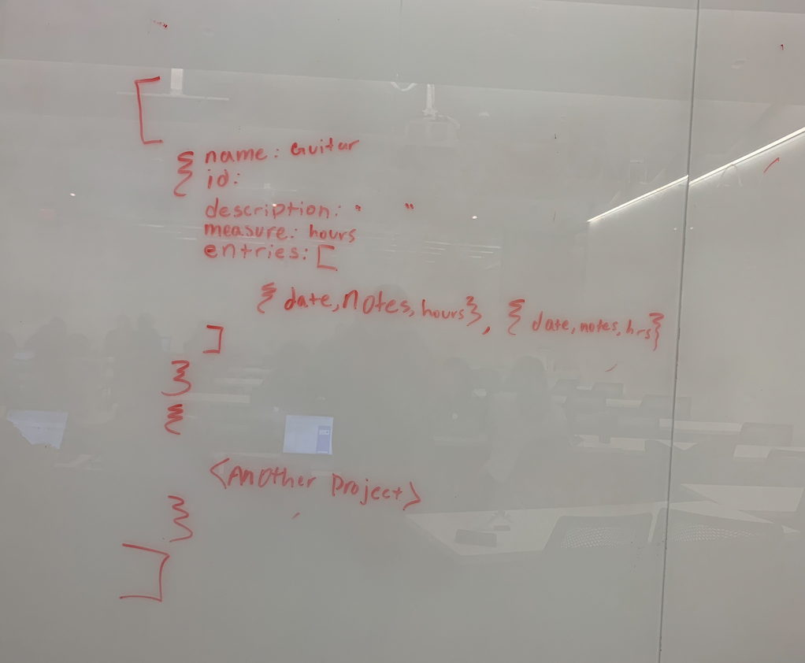
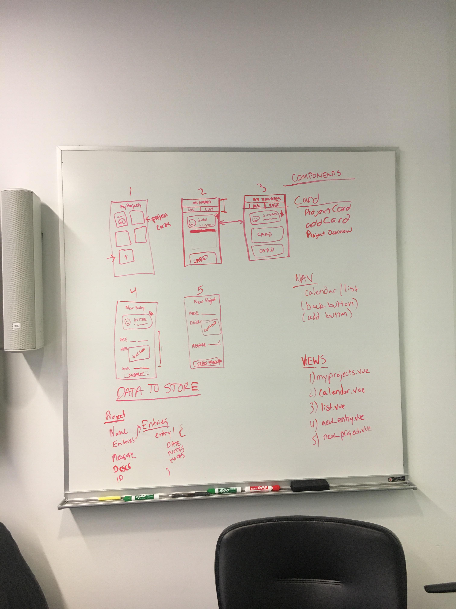

# Milestone 4: Table of Contents

## Individual Team Member Efforts:

### Constantin Miranda (cym8)
- Planning Stage (views, components, JSON structure).
- Implementation of Buefy calendar
  - Linking calendar to data source so that events display.
  - Implementing calendar onClick functionality to display specific logged events for a chosen date.
  - CSS modifications for calendarview.vue


### Hanna Arfine (ha264)
- HiFi Sketch Mockups
- Planning Stage (views, components, JSON structure).
- Implementation of Add Project
  - Created LocalStorage JSON item, defined fields, indexing, etc.
  - CSS for AddProject.vue
- Implementation of Add Entry
  - Created LocalStorage JSON item, defined fields, indexing, etc.
  - CSS for AddEntry.vue
- Implementation of delete project and delete entry
  - LocalStorage manipulation and CSS
- Implementation of Homepage
  - Wrote function to load all existing project
  - CSS for displaying projects
- Helped with implementation of Buefy calendar
  - Get all entries for a project, define them as Buefy entries
  - Linked data source to display events
  - CSS styling
  - Helped write function to display all entries for date onClick
- Implementation of emoji functionality
  - Ordered all project entries by date
  - Defined emojis across the platform (home page and project details pages) based on the date of most recent entry

### Jessica Prague (jnp49)
- Planning Stage (views, components, JSON structure).
- Worked out the psuedocode and organization of the JSON (first image below)
- Defined emojis across the platform (home page and project details pages) based on the date of most recent entry
- Helped with the implementation of Add Entry
  - Created getTodaysDate() so the default value is always today's date
  - Set up the form input bindings using v-model for project name, description, date, notes, and measure
- Set up the Vue Router and linked all the components
- Helped to design and redesign the AddEntry.vue and AddProject.vue form pages

### Jintana Cunningham (jc2747)
- Planning Stage (views, components, JSON structure).
- Implementation of the home page, CSS modification and functionality
    - Access LocalStorage JSON item to display on home page
- Helped design submenu for the project page
- redesigned Project page for smoother user flow
- Bug tested
- overall CSS modifications

### Ellen Xu (ex24)
- Planning Stage (views, components, JSON structure)
- Implementation of the home page CSS modification and functionality
  - Connected JSON data from other pages to Homescreen.vue
  - Ensured connected data was updated correctly and there was a visual cue to its function
    - i.e. .add-button, .btn-content, #home-emoji
  - Created getlastdate() to get a list of entries from a project
    - Used to get the facial emoji expression & organize the entries on the All Entries pages

### Hamed Rabah (hr277)
- Planning Stage (views, components, JSON structure)
- Implementation of Buefy calendar
  - Linking calendar to data source so that events display.
  - Implementing calendar onClick functionality to display specific logged events for a chosen date.
  - CSS modifications for calendarview.vue

## Structure Planning



- The above image shows our project structure planning. We first started by sketching out each screen and labeling the different elements on each screen. We then agreed on the various 'views' that we would implement and decided on the name for each file. This ensured that we would all know which vue file corresponded to each screen.
- we agreed that we would be designing for iPhone X
- We also worked out our JSON structure. We talked through the various information we would need to store and loosely created a JSON structure.
- Finally, we agreed upon common navigational elements for each screen. These included elements like back buttons and "add" buttons.

## Pseudocode

### AddProject.vue

```
<form>
  [Display add project input form]
</form>

<script>
  [once all necessary fields are complete, activate submit button]
  [on submit, get fields from form]
    if name not filled out:
       display error field, ask for name
    if all fields complete:
      get localStorage JSON
        if first entry
           create "projects"
        if not first entry
          push to end of projects array
          assign color from array of color combos
</script>
```

### AddEntry.vue
```
<script>
  [Get project details from localStorage]
</script>

<form>
  [Display add entry input form]
</form>

<script>
  [Once all necessary fields are complete, activate submit button]
  [on submit, get fields from form]
  [Get project entries array]
  [Push new entry to end of project entries]
  [Stringify update entries array, push to LocalStorage]

</script>


```

###ProjectDetailsList.vue
```
<script>
  [Use index prop to get project details from localStorage]
  [Assign face by ordering entries by date, comparing current date to most recent entry]
</script>

<template>
  [Display project panel with title, colors, face]
  [Display all entries]
  [Add Entry button at bottom, route to AddEntry.vue]
</template>
```


### homescreen.vue
```
  <template>
    <div>

    [list all the active projects: name, color, and emoji]  

    </div>
  </template>

<script>

  display(){
    [Function that displays the JSON data]

  }
  getColor(){
    [Function that gets the color the user selects from adding a project]
  }
  getlastdate(){
      [looks for the last entry date from today's date that the user added]
        [creates an array of project entries]
        [if the entries length is greater than zero]
          [find & return  last entry date]

          [creates emoji/facial expression based on last date of entry]
            [if the difference in the last entry to today is less than or equal to two days]
              [project a smile face]
            [else if the difference is between two days and five days non-inclusive]
              [project a flat face]
            [else ]
              [project a frown face]
          [else when there's no entries]
            [project a flat face]
  }

  </script>

```


### calendarview.vue
```
  <template>
    <div>

      [navigational structure from other views here]

      [project information card: faces, project name, project description]

      [Buefy Calendar: Gets events from 'events' data object and indicators from indicators object]

      [Specific Entries on Calendar Click: Listen for event emitted from calendar]

          Run getSpecificEntries() upon click.

      [Specific Entry Display: Display specific existing events when calendar date is clicked.]

          Read from data object containing events only pertaining to date clicked.

          Iterate through using 'v-for', display entry name, notes, and date.

    </div>
  </template>

  <script>
    data() {
      projectEntries: Array for all Entries.
      specificEntries: Array for entries specific to date clicked on
    }

    getProject() {
      Query JSON, collect current project information
    }

    getAllEntries() {
      Query JSON, collect all existing events from storage.
    }

    getSpecificEntries() {
      Event emitted on click includes chosen date.
      Compare chosen date to existing logged events by iterating through array.
      If any existing events match:
        Add to temporary array
      Else:
        Nothing.
      Set data object to temporary array.
    }

  </script>


  <style>

    Styling for calendarview, matches styling for other views with similar elements.

  </style>
```

## Development Practices:

### Branches:
We used a feature-based approach in our branches to ensure that one person's work wouldn't affect another's until each is ready to be applied to master.

- RouterTwo: We created this branch to figure out how to link all components using a Router. We used a branch instead of doing this work on master to account for potential errors (and to make sure that these errors did not ruin the current implementation of the app.) Once the routing was working correctly. we merged RouterTwo into master.

- addEntry: We created this branch to test the addEntry page. We used this page to create a JSON for each entry. We used this branch to ensure that there were no merge conflicts, especially since we were oftentimes working on the same page.

- addProjects: We created this branch to work on the AddProject.vue page. More specifically, this branch was created so that we could add the preset color schemes of the projects.

- calendar_data: We created this branch to work on the calendarview.vue and ProjectDetailsList.vue pages. In the ProjectDetailsList.vue page the router was added. In the calendarview.vue page so that it shows entries.

- changing_screens: We created this branch to hide a project screen once the user adds a project. This will allow the user to have fluidity when using the app and will prevent them from being stuck on a page.

- delete_branch: We created this branch to allow for the user to archive a project branch if they no longer want to track their progress on that particular activity.

- delete_project: We created this branch so that users could delete entries if they no longer want to track their progress on that particular activity.

- home_panel: We created this branch to start off the homescreen.vue page. This branch was added to create a foundation for the page and add more functionality to it.

- homepage: We created this branch to add onto the homescreen.vuepage. This branch specificallly adds a getForm function.

- jinny: We created this branch for one of our members, jintana, who worked on some css styling of the home page.

- json_resructuring: We created this branch to clean up some comments and delete some debugging console logs.

- project_details: We created this branch to add more styling to the ProjectDetailsList.vue page.

- calendarView: We created this branch for the calendarView functionality (page w/ calendar that shows specific entries onClick). Merged into master once most of development was done. Implemented some fixes/integration once bugs/issues were discovered post-merge.
