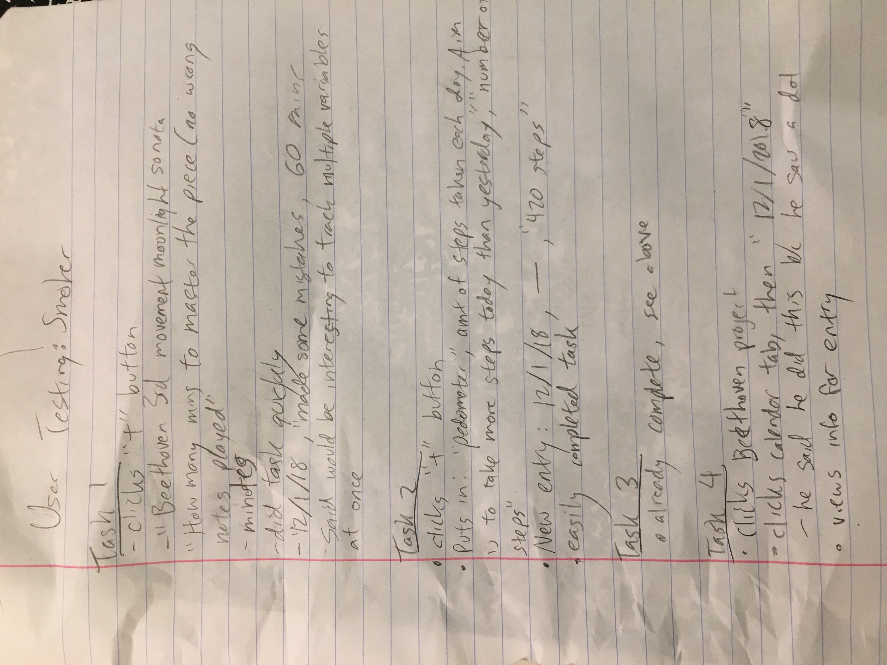
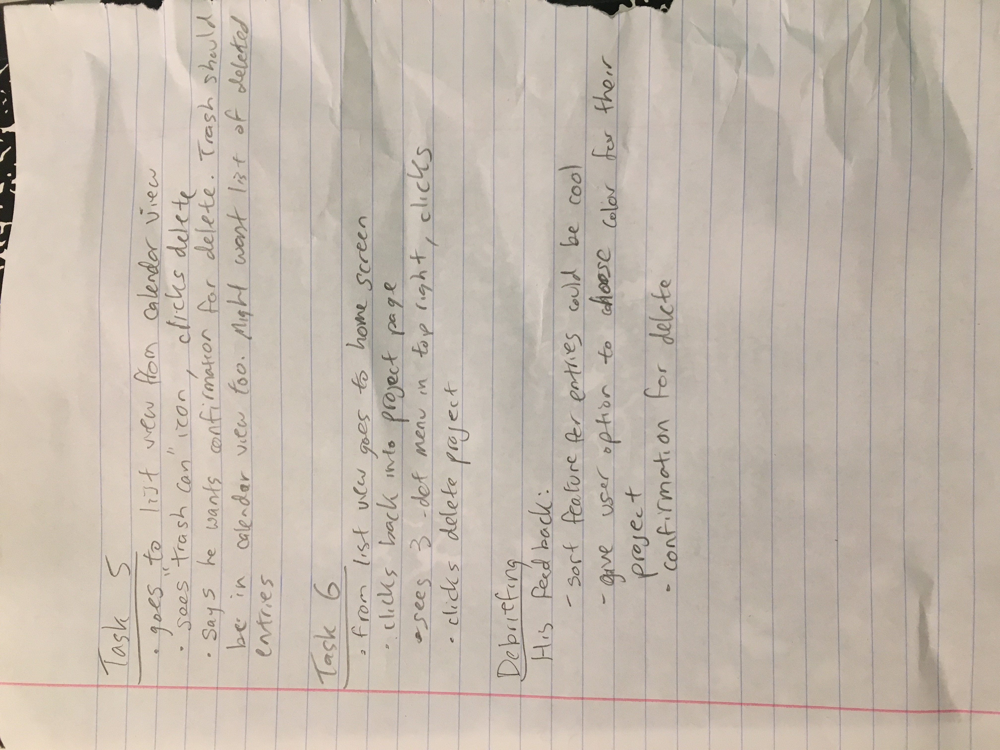

# User Testing Session w/ Piano Player

  
  

## Task 1: “Set up a new tracking project with an existing measure type.”
- User is presented with empty home screen, showing only “+” button.
- User clicks “+” button, prompted to fill in new project information
  - Info Input:
    - “Beethoven 3rd movement moonlight sonata”
    - “How many minutes does it take to master the piece ie. no wrong notes played”
    - “Minutes”
  - Notes:
    - User completed this with accuracy and ease
    - Had no trouble picking the data measure type
- User is then prompted to add a new entry
  - Info Input:
    - “12/1/2018”
    - “made some mistakes”
    - “60 minutes”
  - Notes:
    - He said it would be interesting to track have multiple variables at once

## Task 2: Set up a new tracking project with your own custom data type.
- User is presented with empty home screen, showing only “+” button.
- User clicks “+” button, prompted to fill in new project information
  - Info Input:
    - “Pedometer”
    - “Amounts of steps taken each day. Aim is to take more steps today than yesterday”
    - “Number of steps”
  - Notes:
    - User seamlessly figured out how to add a new data measure type.
- User is prompted to add a new entry
  - Info Input:
    - “12/1/2018”
    - “---”
    - “420 steps”
  - Notes:
    - User completed this task easily.

## Task 3: Add a new entry to your project.
- Included in above tasks

## Task 4: View the entries for a specific date.
- User is on the project home screen.
- User selects existing project (“Beethoven 3rd movement moonlight sonata”) that he set up
- User clicks on calendar tab
- User clicks on “12/1/2018”
  - When asked why he did this, he said that he clicked on it because he saw a dot
- User views information for 12/1/2018 entry
- Notes:
  - The user was able to accomplish this task easily and there were enough signifiers to suggest what his next step should be.

## Task 5: Delete a specific entry from your project.
- User is on calendar list
- Navigates back to list view, sees “trash can” icon
- Clicks delete
- Notes:
  - User wants a confirmation for the delete. Might want to have list of deleted entries. Trash can should also be in calendar view.

## Task 6: Delete an entire project.
- User is on list view.
- User goes to home screen.
- User clicks into project page
- User sees three dot menu bar in top right, clicks that
- User clicks “delete project”

## Debriefing:
> User thought that the application was generally well designed. However, he did make a view suggestions that he thought might make the flow a little simpler:
  - sort feature for the entries
  - give user option to choose color for their projects
  - wants a confirmation for the delete
