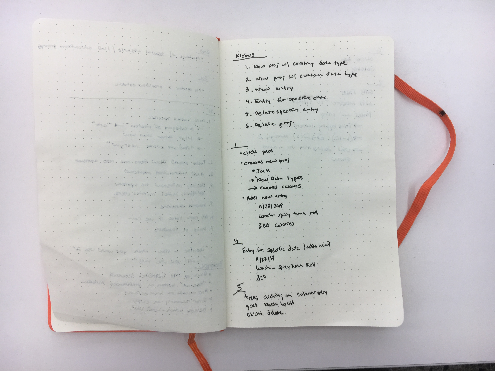
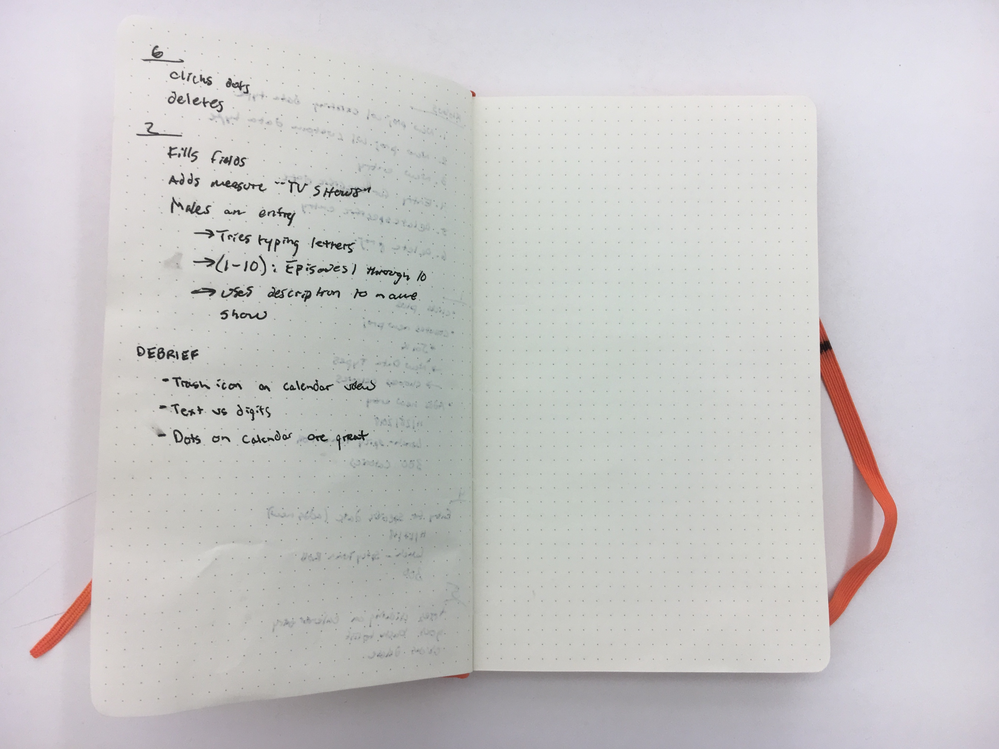

# User Testing Session w/ Sprint Football Player

## Images
  ### Notes: Page 1
  
  ### Notes: Page 2
  

## Task 1: “Set up a new tracking project with an existing measure type.”
- User is presented with empty home screen, showing only “+” button.
- User clicks “+” button, prompted to fill in new project information
  - Info Input:
    - “Jon K”
    - “My Project”
    - “Calories”
  - Notes:
    - User completed this with accuracy and ease. One thing to note is that he named the project his own name, instead of a goal.
    - Had no trouble picking the data measure type
- User is then prompted to add a new entry
  - Info Input:
    - “11/28/2018”
    - “Lunch - Spicy Tuna Roll”
    - “300”
  - Notes:
    - User was a little confused when prompted with this screen immediately. But once he read the header he understood what was going on.

## Task 2: Set up a new tracking project with your own custom data type.
- User is presented with empty home screen, showing only “+” button.
- User clicks “+” button, prompted to fill in new project information
  - Info Input:
    - “Jon K”
    - “TV Habits”
    - “TV SHOWS”
  - Notes:
    - User seamlessly figured out how to add a new data measure type.
- User is prompted to add a new entry
  - Info Input:
    - “11/28/2018”
    - “Breaking Bad”
    - “1-10”
  - Notes:
    - User at first wanted to enter text into the TV SHOWS measure field. Field did not allow him to do so, so then he used the description to add the desired text and then used the field to specify the episode range.

## Task 3: Add a new entry to your project.
- Included in above tasks

## Task 4: View the entries for a specific date.
- User is on the project home screen.
- User selects existing project (“Jon K”) that he set up
- User is on the “list” view
- User clicks on calendar tab
- User clicks on “11/27/2018”
  - When asked why he did this, he said that he clicked on it because he saw a dot
- User views information for 11/27/2018 entry
- Notes:
  - The user was able to accomplish this task easily and there were enough signifiers to suggest what his next step should be.

## Task 5: Delete a specific entry from your project.
- User is on calendar list, tries clicking on entry card but nothing happens.
- Navigates back to list view, sees “trash can” icon
- Clicks delete
- Notes:
  - User was a little confused as to why he couldn’t delete on the calendar view page. But he figured out that he should go to the entire list to delete a specific entry.

## Task 6: Delete an entire project.
- User is on list view.
- User’s eyes scan screen for about 10 seconds, looking for something to click on.
- User sees three dot menu bar in top right, clicks that
- User clicks “delete project”

## Debriefing:
> User thought that the application was generally well designed. However, he did make a view suggestions that he thought might make the flow a little simpler:
  - Perhaps give users the opportunity to delete from the calendar view
  - Thought it was confusing that you could choose a measure that suggests text, but then would be forced to input digits. But, he also noted that since he figured out a way around it, it wasn’t a big deal.
  - User really liked the design. Also specifically complimented the dots on the calendar and thought that the implementation was clear (it made sense to click on the dots to view events for that date).
